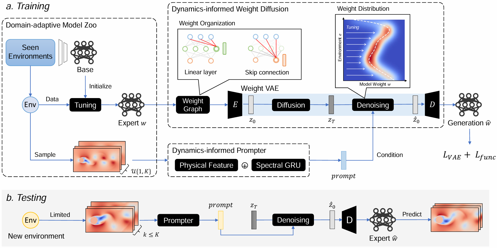

# 🌊 DynaDiff

Official implement of **ICML'26**  "*Adaptation of Dynamics to Environmental Shifts via Weight-space Diffusion*", a novel approach for explicitly modeling the conditional dependence of the predictive model on environments.



&nbsp;

## 🚀 Demo (Cylinder Flow)

> DynaDiff relies only on common deep learning libraries, including `torch`, `tqdm`, `torchmetrics`, and `sklearn`.

Experience our pretrained model by generating weights for a new environment in **just 10 seconds** using **only 1.7GB GPU memory**!

### Steps to Run the Demo

1️⃣ **Download Checkpoints**📂(3.96GB): [download link](https://drive.proton.me/urls/TGH3H3XRQG#4cqQAvjnb1OX)

2️⃣ **Execute**: Open and run `demo.ipynb`

1. **Select Environment**

   Default setting: `Re=210.0, r=10.0`, `Re=240.0, r=19.0`, `Re=270.0, r=24.0`

   Download additional environments📂(0.70GB): [download link](https://drive.proton.me/urls/WQ4RJJQGFC#vZSofVzVywrs)

2. **Generate Model Weights**

   The model generates weights in approximately **10 seconds** with only **1.7GB GPU memory**.

3. **Evaluate Model Weights**

4. **Visualize Results**

3️⃣  **Train from scratch**

- Download Model Zoo📂(about 18GB): available post-acceptance

- Data Preprocess

  ```shell
  python fno_LDM/train/prepare.py
  ```

- Train Weight VAE

  ```sh
  python fno_LDM/train/_cy_vae.py --zoo_size 1
  ```

- Train Weight Diffusion

  ```shell
  python fno_LDM/train/_cy_ldm.py --zoo_size 1
  ```

&nbsp;

## 📁 Repository Structure

```sh
.
├── README.md
├── asset
│   ├── result.png
│   └── result2.png
├── data
│   └── cy_ (Additional files available for download)
│       ├── Re_210.0_r_10.0.npy
│       ├── Re_270.0_r_24.0.npy
│       └── Re_290.0_r_19.0.npy
├── demo.ipynb
├── fno_LDM
│   ├── model
│   │   ├── __init__.py
│   │   ├── diffusion.py
│   │   ├── diffusion_utils.py
│   │   ├── dit.py
│   │   ├── fno.py
│   │   ├── fno_graph_construct.py
│   │   ├── fno_graph_vae.py
│   │   └── graph_normalize.py
│   └── train
│       ├── _cy_ldm.py
│       ├── _cy_vae.py
│       ├── evaluate.py
│       ├── prepare.py
│       └── utils.py
├── weights (Download required)
│   ├── ldm.pt
│   └── vae.pt
└── zoo
    └── cy_
        └── fno
            └── minmax_dict.pkl
            └── origin
            │   ├── Re210.0_r10.0
            │   │   └── seed0
            │   │       └── epoch1000.pt
            │   ├── Re240.0_r19.0
            │   │   └── seed0
            │   │       └── epoch1000.pt
            │   └── Re270.0_r24.0
            │       └── seed0
            │           └── epoch1000.pt
            └── Additional training files (Available post-acceptance)
```

&nbsp;

## 📌 Notes

- This implementation provides a **demo of Cylinder Flow system** . 
- The weights provided in the Model Zoo are limited to one per environment for demonstration purposes. The full model zoo will be released after acceptance.
- The complete version, including additional environments and datasets, will be made available upon manuscript acceptance.
